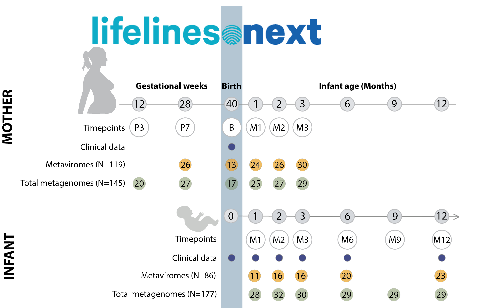
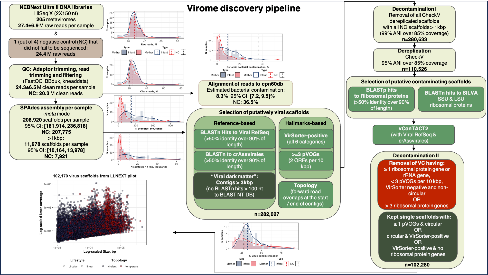

# Transmission and Dynamics of Mother-Infant Gut Viruses during Pregnancy and Early Life

Code for our paper "Transmission and Dynamics of Mother-Infant Gut Viruses during Pregnancy and Early Life".

## Citation
Garmaeva, S., Sinha, T., Gulyaeva, A. et al. Transmission and dynamics of mother-infant gut viruses during pregnancy and early life. Nat Commun 15, 1945 (2024). https://doi.org/10.1038/s41467-024-45257-4

You can download the paper from [here](https://rdcu.be/dz9jv).

## One-Sentence Summary
We studied the dynamics of the maternal virome during and after pregnancy, the infant virome during early life, with a particular focus on the transmission of viral strains from mothers to their infants. 

## Abstract
Early development of the gut ecosystem is crucial for lifelong health. While infant gut bacterial communities have been studied extensively, the infant gut virome remains under-explored. To study the development of the infant gut virome over time and the factors that shape it, we longitudinally assess the composition of gut viruses and their bacterial hosts in 30 women during and after pregnancy and in their 32 infants during their first year of life. Using shotgun metagenomic sequencing applied to dsDNA extracted from Virus-Like Particles (VLPs) and bacteria, we generate 205 VLP metaviromes and 322 total metagenomes. With this data, we show that while the maternal gut virome composition remains stable during late pregnancy and after birth, the infant gut virome is dynamic in the first year of life. Notably, infant gut viromes contain a higher abundance of active temperate phages compared to maternal gut viromes, which decreases over the first year of life. Moreover, we show that the feeding mode and place of delivery influence the gut virome composition of infants. Lastly, we provide evidence of co-transmission of viral and bacterial strains from mothers to infants, demonstrating that infants acquire some of their virome from their mother’s gut.

## Study design

## Data availability
Sample information, basic phenotypes, family structure and raw sequences are available in the [EGA archive](https://ega-archive.org/studies/EGAS00001005969). To access the data, please follow [these instructions](https://github.com/GRONINGEN-MICROBIOME-CENTRE/LLNEXT_pilot/blob/main/Data_Access_EGA.md).
Virus scaffolds composing the virus database generated from the samples can be found at [FigShare](https://doi.org/10.6084/m9.figshare.23926593)

## Code availability
[Virome discovery pipeline:](https://github.com/GRONINGEN-MICROBIOME-CENTRE/LLNEXT_pilot/tree/main/Virome_discovery)
All scripts used to profile human gut virome and microbiome

[Building virus consensuses:](https://github.com/GRONINGEN-MICROBIOME-CENTRE/LLNEXT_pilot/tree/main/Viral_alignments)
All scripts used to generate consensus sequences for vOTUs shared between mothers and their infants

[Downstream analysis:](https://github.com/GRONINGEN-MICROBIOME-CENTRE/LLNEXT_pilot/tree/main/Downstream_analysis)
All scripts used for processing abundance tables and distance matrices, including plots

[Bacterial strains reconstruction:](https://github.com/GRONINGEN-MICROBIOME-CENTRE/LLNEXT_pilot/blob/main/bacterial_strain_reconstruction_Strainphlan_4.md)
Code used to generate distance matrices for bacterial hosts of viruses of interest
